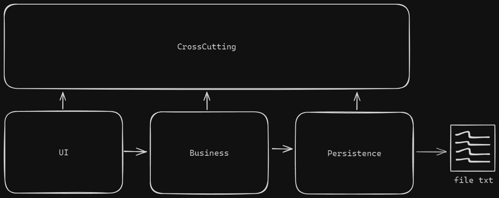

# AppAgendaEventos

AppAgendaEventos es un proyecto desarrollado para gestionar eventos y su información. Permite administrar imágenes y otros datos complementarios, los cuales se gestionan en un archivo TXT. Además, incluye opciones para filtrar eventos por nombre, fechas o estado.

## Arquitectura

El proyecto está estructurado en diferentes capas y bibliotecas de clases que interactúan entre sí para manejar las funciones de la aplicación. A continuación, se detallan los componentes principales.



## Instalación

### Requisitos basicos

- SDK .NET 8.0 o superior

### Pasos

1. **Clona el repositorio**:
    ```bash
    git clone https://github.com/frackfernandez/AppAgendaEventos.git
    cd AppAgendaEventos
    ```

2. **Restaura las dependencias**:
    ```bash
    dotnet restore
    ```

3. **Compila el proyecto**:
    ```bash
    dotnet build
    ```

## Contribuciones

Se agradecen las contribuciones. Por favor, sigue el proceso habitual en GitHub para realizar un fork, crea una rama, haz los cambios y envía un pull request.

## Licencia

Este proyecto está bajo la [MIT License](https://opensource.org/licenses/MIT).